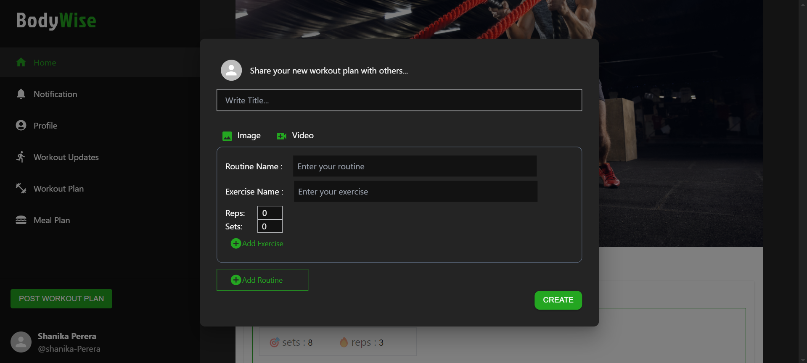
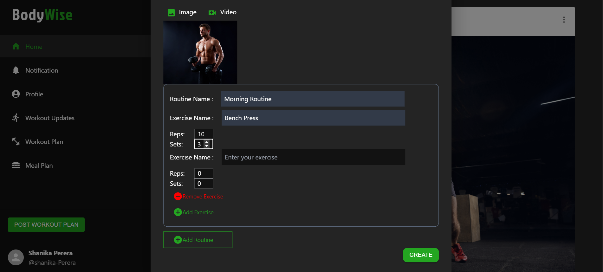

# BodyWise -PAF Project
social media platform tailored for fitness enthusiasts to share their fitness journey, workouts, and healthy  lifestyle tips

• Workout plan sharing: 
  - Allow users to share their workout plans, including routines, exercises, sets, and 
    repetitions. 
  - Provide templates for users to create and customize their workout plans within the 
    platform. 
  - Enable users to update their workout plans over time as their fitness goals and 
    preferences evolve.

     

  
---Login Page & Register Page---

  

    
    
  

 

  
---Home Page---

  

    
    
    
  

 

  
---Template for create workout plan---

  

    
    
  

 

  
---Template for update workout plan---

  

    
  

